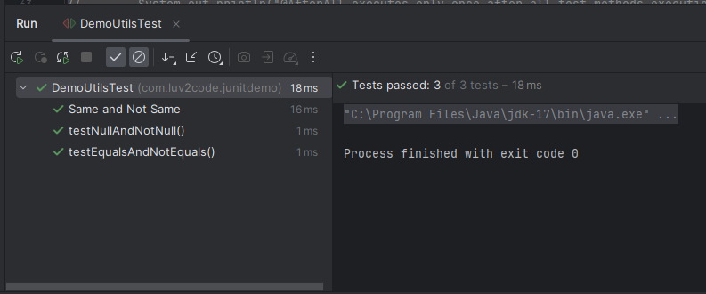
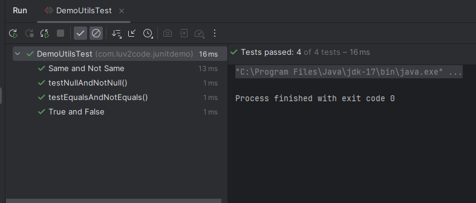

# 14. JUnit Assertions - Same/NotSame and True/False - Coding

### Approach 1 - We are creating Test Cases for the below methods 
```Java
    private String academy = "Luv2Code Academy";
    private String academyDuplicate = academy;

    public String getAcademy() {
        return academy;
    }

    public String getAcademyDuplicate() {
        return academyDuplicate;
    }

    // Inside the test file 
    @Test
    @DisplayName("Same and Not Same")
    void testSameAndNotSame(){

        // The test below will pass, if so the two values are same. Else it will display the desired message
        assertSame(demoUtils.getAcademy(), demoUtils.getAcademyDuplicate(), "Objects should refer to the same object");
        // The test below will pass, if so the two values are not same. Else it will display the desired message
        assertNotSame(demoUtils.getAcademy(), demoUtils.getAcademyInList(), "Objects should not refer to the same object");
    }
```
### Output 


### Approach 2 - We are creating Test Cases for the below methods 
```Java
    public Boolean isGreater(int n1, int n2) {
        if (n1 > n2) {
            return true;
        }
        return false;
    }
    // Inside the test file
    @DisplayName("True and False")
    @Test
    void testTrueFalse(){
        int gradeOne = 10;
        int gradeTwo = 5;

        assertTrue(demoUtils.isGreater(gradeOne, gradeTwo), "This should return true");
        assertFalse(demoUtils.isGreater(gradeTwo, gradeOne), "This should return false");
    }
```
### Output



