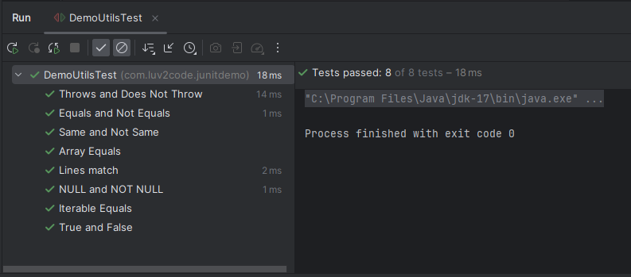
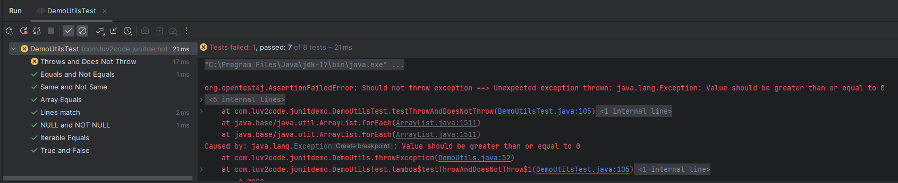

# 18. JUnit Assertions - Throws - Coding 

### Method 1 - Creating test classes for the below method 
```Java
    public String throwException(int a) throws Exception {
        if (a < 0) {
            throw new Exception("Value should be greater than or equal to 0");
        }
        return "Value is greater than or equal to 0";
    }

    // Respective Test Function - Success Condition
    @DisplayName("Throws and Does Not Throw")
    @Test
    void testThrowAndDoesNotThrow(){
        assertThrows(Exception.class, () -> { demoUtils.throwException(-1);}, "Should throw exception");
        // As the function accepts a value that is greater than zero it shouldn't throw any exception
        assertDoesNotThrow(() -> { demoUtils.throwException(9);}, "Should not throw exception");
    }

```
### Output



### Respective Failure Condition
```JAva
    @DisplayName("Throws and Does Not Throw")
    @Test
    void testThrowAndDoesNotThrow(){
        assertThrows(Exception.class, () -> { demoUtils.throwException(-1);}, "Should throw exception");
        // As the function accepts a value that is greater than zero it shouldn't throw any exception
        // But here it is -1 so it has to throw an error
        assertDoesNotThrow(() -> { demoUtils.throwException(-1);}, "Should not throw exception");
    }
```
### Output


