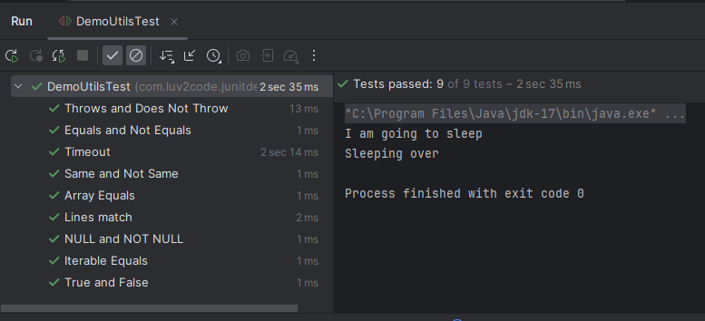

# 19. JUnit Assertions - Timeout - Coding 

### Method 1 - Creating test classes for the below method 
```Java
    public void checkTimeout() throws InterruptedException {
        System.out.println("I am going to sleep");
        Thread.sleep(2000);
        System.out.println("Sleeping over");
    }

    // Respective Test Function - Success Condition
    @DisplayName("Timeout")
    @Test
    void testTimeout(){
        assertTimeoutPreemptively(Duration.ofSeconds(3), ()->{demoUtils.checkTimeout();}, "Method should execute in 3 seconds");
    }

```
### Output



### Respective Failure Condition
```JAva
    @DisplayName("Timeout")
    @Test
    void testTimeout(){
        assertTimeoutPreemptively(Duration.ofSeconds(2), ()->{demoUtils.checkTimeout();}, "Method should execute in 2 seconds");
    }
```
### Output


