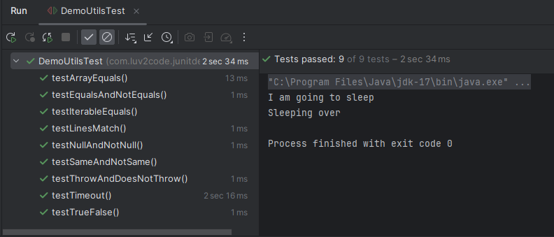
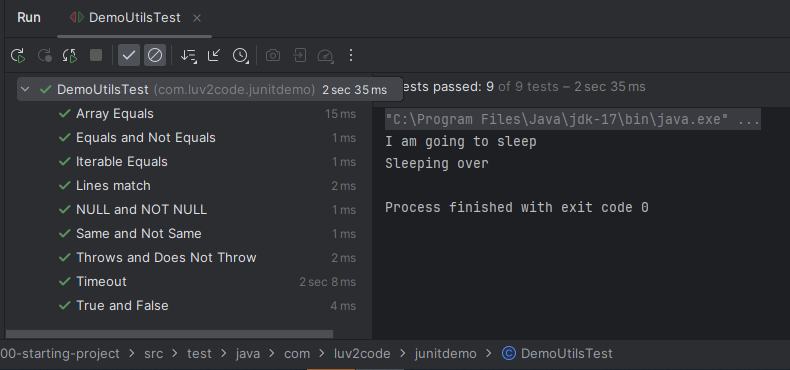
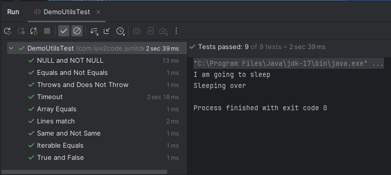

# 20. Ordering JUnit Tests - Coding

### Below is an implementation of the MethodName.class
```Java
@TestMethodOrder(MethodOrderer.MethodName.class)
public class DemoUtilsTest {
    DemoUtils demoUtils;

    @BeforeEach
    void setupBeforeEach(){
        demoUtils = new DemoUtils();
    }

    // Testing the add method
    @Test
    void testEqualsAndNotEquals(){

        // The test below will pass, if so the two values are equal. Else it will display the desired message
        assertEquals(6,demoUtils.add(2,4), "2+4 must be 6");
        //// The test below will pass, if so the two values are not equal. Else it will display the desired message
        assertNotEquals(6,demoUtils.add(1,9), "1 + 9 must not be 6");

    }

    @Test
    void testNullAndNotNull(){

        String str1 =null;
        String str2 = "Vibhav";

        assertNull(demoUtils.checkNull(str1), "Object should be null");
        assertNotNull(demoUtils.checkNull(str2), "Object should not be null");
    }

    @Test
    void testSameAndNotSame(){

        // The test below will pass, if so the two values are same. Else it will display the desired message
        assertSame(demoUtils.getAcademy(), demoUtils.getAcademyDuplicate(), "Objects should refer to the same object");
        // The test below will pass, if so the two values are not same. Else it will display the desired message
        assertNotSame(demoUtils.getAcademy(), demoUtils.getAcademyInList(), "Objects should not refer to the same object");
    }


    @Test
    void testTrueFalse(){
        int gradeOne = 10;
        int gradeTwo = 5;

        assertTrue(demoUtils.isGreater(gradeOne, gradeTwo), "This should return true");
        assertFalse(demoUtils.isGreater(gradeTwo, gradeOne), "This should return false");
    }


    @Test
    void testArrayEquals(){
        String[] expectedArray = {"A", "B", "C"};
        String[] resultArray = demoUtils.getFirstThreeLettersOfAlphabet();
        assertArrayEquals(expectedArray, resultArray, "Arrays should be the same");
    }

    @Test
    void testIterableEquals(){
        List<String> theList = List.of("luv", "2" , "code");
        assertIterableEquals(theList, demoUtils.getAcademyInList(), "Expected list should be same as actual list");
    }


    @Test
    void testLinesMatch(){
        List<String> theList = List.of("luv","2","code");
        assertLinesMatch(theList, demoUtils.getAcademyInList(), "Lines Should match");
    }


    @Test
    void testThrowAndDoesNotThrow(){
        assertThrows(Exception.class, () -> { demoUtils.throwException(-1);}, "Should throw exception");
        // As the function accepts a value that is greater than zero it shouldn't throw any exception
        assertDoesNotThrow(() -> { demoUtils.throwException(9);}, "Should not throw exception");
    }

    @Test
    void testTimeout(){
        assertTimeoutPreemptively(Duration.ofSeconds(3), ()->{demoUtils.checkTimeout();}, "Method should execute in 3 seconds");
    }
}
```
### Output


### If you want to order them based on DisplayName
### Then your output looks something like this 



### Below is an implementation of the OrderAnnotation Class
```Java
@TestMethodOrder(MethodOrderer.OrderAnnotation.class)
public class DemoUtilsTest {
    DemoUtils demoUtils;

    @BeforeEach
    void setupBeforeEach(){
        demoUtils = new DemoUtils();
    }
    // Testing the add method
    @Test
    @DisplayName("Equals and Not Equals")
    @Order(1)
    void test_Equals_And_Not_Equals(){

        // The test below will pass, if so the two values are equal. Else it will display the desired message
        assertEquals(6,demoUtils.add(2,4), "2+4 must be 6");
        //// The test below will pass, if so the two values are not equal. Else it will display the desired message
        assertNotEquals(6,demoUtils.add(1,9), "1 + 9 must not be 6");

    }

    @Test
    @DisplayName("NULL and NOT NULL")
    @Order(0)
    void test_Null_And_Not_Null(){

        String str1 =null;
        String str2 = "Vibhav";

        assertNull(demoUtils.checkNull(str1), "Object should be null");
        assertNotNull(demoUtils.checkNull(str2), "Object should not be null");
    }

    @Test
    @DisplayName("Same and Not Same")
    void testSameAndNotSame(){

        // The test below will pass, if so the two values are same. Else it will display the desired message
        assertSame(demoUtils.getAcademy(), demoUtils.getAcademyDuplicate(), "Objects should refer to the same object");
        // The test below will pass, if so the two values are not same. Else it will display the desired message
        assertNotSame(demoUtils.getAcademy(), demoUtils.getAcademyInList(), "Objects should not refer to the same object");
    }

    @DisplayName("True and False")
    @Test
    void testTrueFalse(){
        int gradeOne = 10;
        int gradeTwo = 5;

        assertTrue(demoUtils.isGreater(gradeOne, gradeTwo), "This should return true");
        assertFalse(demoUtils.isGreater(gradeTwo, gradeOne), "This should return false");
    }

    @DisplayName("Array Equals")
    @Test
    @Order(30)
    void testArrayEquals(){
        String[] expectedArray = {"A", "B", "C"};
        String[] resultArray = demoUtils.getFirstThreeLettersOfAlphabet();
        assertArrayEquals(expectedArray, resultArray, "Arrays should be the same");
    }

    @DisplayName("Iterable Equals")
    @Test
    void testIterableEquals(){
        List<String> theList = List.of("luv", "2" , "code");
        assertIterableEquals(theList, demoUtils.getAcademyInList(), "Expected list should be same as actual list");
    }

    @DisplayName("Lines match")
    @Test
    @Order(50)
    void testLinesMatch(){
        List<String> theList = List.of("luv","2","code");
        assertLinesMatch(theList, demoUtils.getAcademyInList(), "Lines Should match");
    }

    @DisplayName("Throws and Does Not Throw")
    @Test
    @Order(30)
    void testThrowAndDoesNotThrow(){
        assertThrows(Exception.class, () -> { demoUtils.throwException(-1);}, "Should throw exception");
        // As the function accepts a value that is greater than zero it shouldn't throw any exception
        assertDoesNotThrow(() -> { demoUtils.throwException(9);}, "Should not throw exception");
    }

    @DisplayName("Timeout")
    @Test
    @Order(30)
    void testTimeout(){
        assertTimeoutPreemptively(Duration.ofSeconds(3), ()->{demoUtils.checkTimeout();}, "Method should execute in 3 seconds");
    }

}
```
### Output



