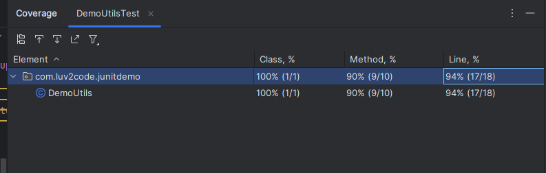
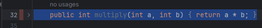
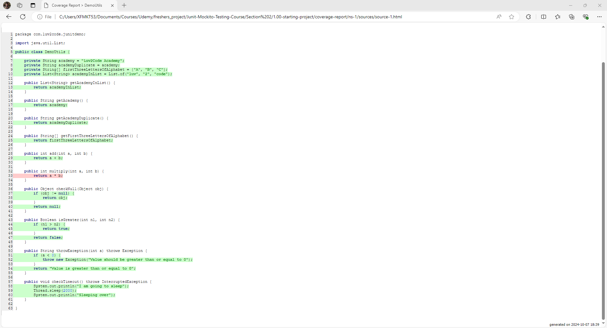
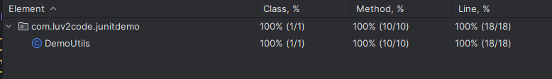
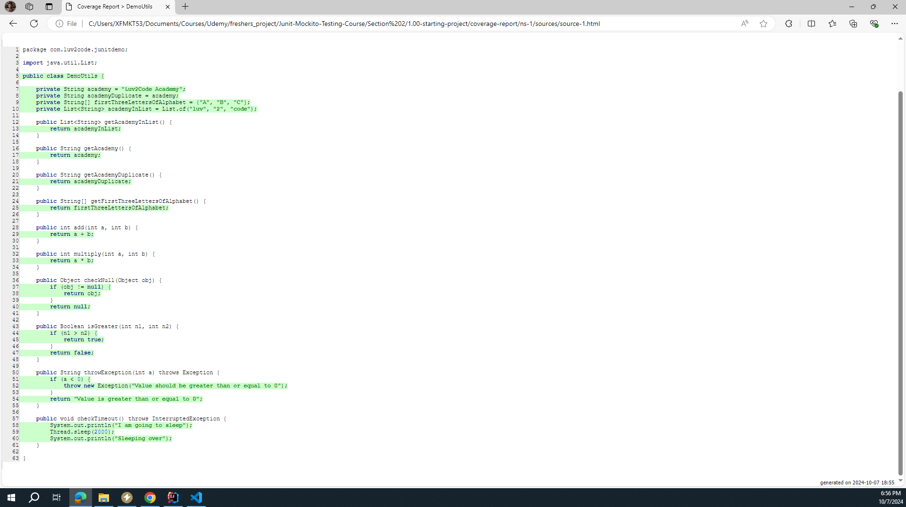
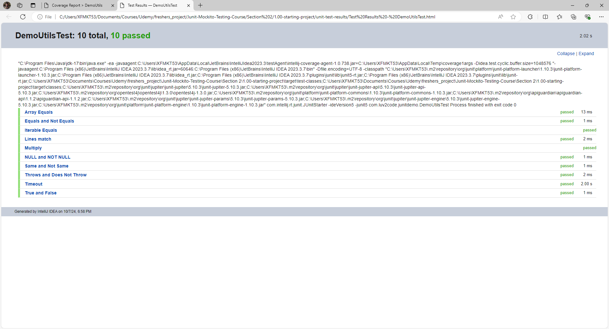

# 23. Unit Testing Code Coverage with IntelliJ - Coding 

### Output

1. 90% of the methods are covered 
2. 95% of the lines are covered 
3. Also if we want we can generate an HTML file for this by clicking the 4th icon from the left

4. **Red bar** - mean that we don't have a unit Test that convers the method
  

### This is how the actual html page looks

### Previously testing method was not written for Multiply method and now after writing the percentage accuracy increased
  
As we can see from the image, the percentage increased to 100% cause everything is covered in the testing now 

### After exporting the test Results to an HTML page 

## Can also generate Test Reports

