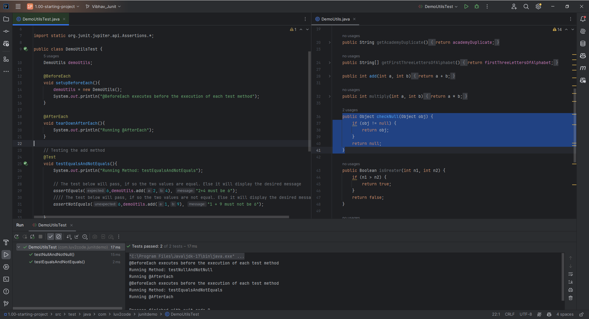
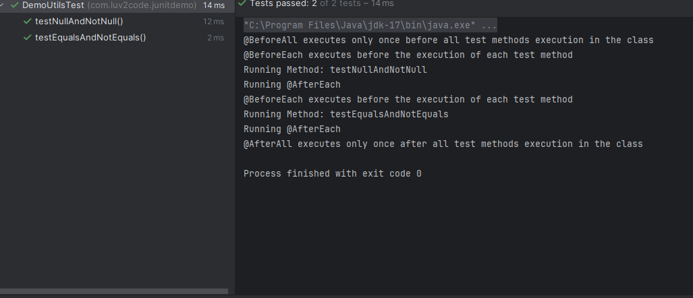

# 10. Test Case Lifecycle Methods - Coding

### Case 1 - Using @BeforeEach and @AfterEach Annotation

```Java
    DemoUtils demoUtils;

    @BeforeEach
    void setupBeforeEach(){
        demoUtils = new DemoUtils();
        System.out.println("@BeforeEach executes before the execution of each test method");
    }

    @AfterEach
    void tearDownAfterEach(){
        System.out.println("Running @AfterEach");
    }

    // Testing the add method
    @Test
    void testEqualsAndNotEquals(){
        System.out.println("Running Method: testEqualsAndNotEquals");

        // The test below will pass, if so the two values are equal. Else it will display the desired message
        assertEquals(6,demoUtils.add(2,4), "2+4 must be 6");
        //// The test below will pass, if so the two values are not equal. Else it will display the desired message
        assertNotEquals(6,demoUtils.add(1,9), "1 + 9 must not be 6");

    }

    @Test
    void testNullAndNotNull(){
        System.out.println("Running Method: testNullAndNotNull");

        String str1 =null;
        String str2 = "Vibhav";

        assertNull(demoUtils.checkNull(str1), "Object should be null");
        assertNotNull(demoUtils.checkNull(str2), "Object should not be null");
    }
```
> It is clear from the above code 
    We have deleted the object creation from both of the methods(namely:- testEqualsAndNotEquals and testNullAndNotNull) and combined it with the @BeforeAll method to make sure that object is created every time before the test methods are called


### Case 2 - Using @BeforeAll and @AfterAll Annotation
```Java 
    DemoUtils demoUtils;

    @BeforeEach
    void setupBeforeEach(){
        demoUtils = new DemoUtils();
        System.out.println("@BeforeEach executes before the execution of each test method");
    }

    @AfterEach
    void tearDownAfterEach(){
        System.out.println("Running @AfterEach");
    }

    // Also remember by default the methods must be static
    @BeforeAll
    static void setupBeforeEachClass(){
        System.out.println("@BeforeAll executes only once before all test methods execution in the class");
    }

    // Also remember by default the methods must be static
    @AfterAll
    static void tear(){
        System.out.println("@AfterAll executes only once after all test methods execution in the class");
    }

    // Testing the add method
    @Test
    void testEqualsAndNotEquals(){
        System.out.println("Running Method: testEqualsAndNotEquals");

        // The test below will pass, if so the two values are equal. Else it will display the desired message
        assertEquals(6,demoUtils.add(2,4), "2+4 must be 6");
        //// The test below will pass, if so the two values are not equal. Else it will display the desired message
        assertNotEquals(6,demoUtils.add(1,9), "1 + 9 must not be 6");

    }

    @Test
    void testNullAndNotNull(){
        System.out.println("Running Method: testNullAndNotNull");

        String str1 =null;
        String str2 = "Vibhav";

        assertNull(demoUtils.checkNull(str1), "Object should be null");
        assertNotNull(demoUtils.checkNull(str2), "Object should not be null");
    }
```
#### output



