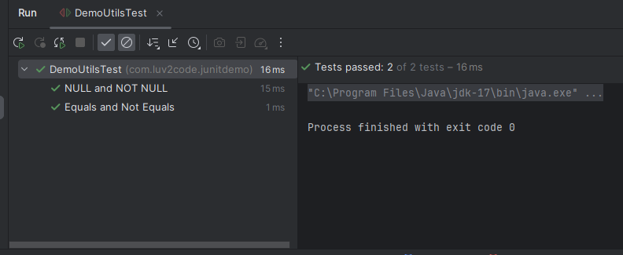
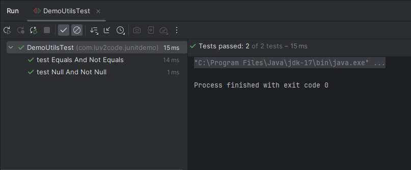
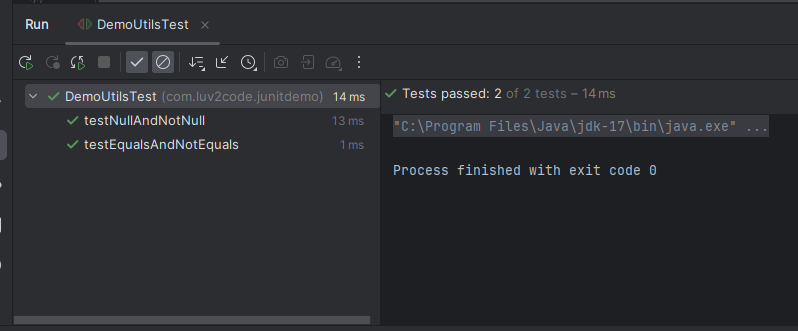
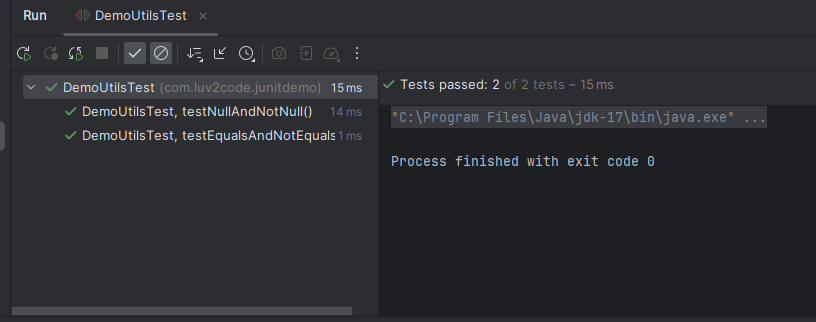

# 12. Defining Custom Display Names - Coding

### Method 1 - Displaying the Custom Display Name using @DisplayName Annotation 
```Java
    DemoUtils demoUtils;

    @BeforeEach
    void setupBeforeEach(){
        demoUtils = new DemoUtils();
    }

    // Testing the add method
    @Test
    @DisplayName("Equals and Not Equals")
    void testEqualsAndNotEquals(){

        // The test below will pass, if so the two values are equal. Else it will display the desired message
        assertEquals(6,demoUtils.add(2,4), "2+4 must be 6");
        //// The test below will pass, if so the two values are not equal. Else it will display the desired message
        assertNotEquals(6,demoUtils.add(1,9), "1 + 9 must not be 6");

    }

    @Test
    @DisplayName("NULL and NOT NULL")
    void testNullAndNotNull(){

        String str1 =null;
        String str2 = "Vibhav";

        assertNull(demoUtils.checkNull(str1), "Object should be null");
        assertNotNull(demoUtils.checkNull(str2), "Object should not be null");
    }
```
### Output 



### Method 2 - Using Generator Class
```Java
@DisplayNameGeneration(DisplayNameGenerator.ReplaceUnderscores.class)
public class DemoUtilsTest {
    DemoUtils demoUtils;

    @BeforeEach
    void setupBeforeEach(){
        demoUtils = new DemoUtils();
    }

    // Testing the add method
    @Test
    void test_Equals_And_Not_Equals(){

        // The test below will pass, if so the two values are equal. Else it will display the desired message
        assertEquals(6,demoUtils.add(2,4), "2+4 must be 6");
        //// The test below will pass, if so the two values are not equal. Else it will display the desired message
        assertNotEquals(6,demoUtils.add(1,9), "1 + 9 must not be 6");

    }

    @Test
    void test_Null_And_Not_Null(){

        String str1 =null;
        String str2 = "Vibhav";

        assertNull(demoUtils.checkNull(str1), "Object should be null");
        assertNotNull(demoUtils.checkNull(str2), "Object should not be null");
    }
}
```
### Output 


### Using Simple DisplayNameGenerators
> @DisplayNameGeneration(DisplayNameGenerator.Simple.class )
### Output 


### Using IndicativeSentences DisplayNameGenerators
> @DisplayNameGeneration(DisplayNameGenerator.IndicativeSentences.class )
### Output 


**Note**
Junit doesn't provide a display name for camelCase Generator


