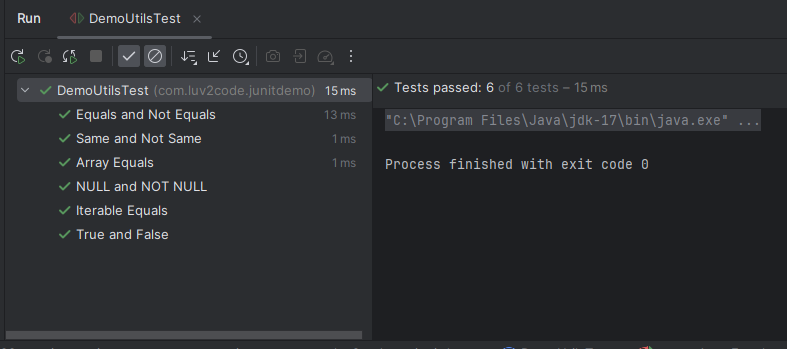

# 16. JUnit Assertions - Arrays, Iterable and Lines - Coding

**NOTE**:- The comparison is done based on ASCII values - **Case Sensitive** 

# Method 1 - assertArrayEquals Example
```Java
    // We test the below method
    private String[] firstThreeLettersOfAlphabet = {"A", "B", "C"};
        public String[] getFirstThreeLettersOfAlphabet() {
        return firstThreeLettersOfAlphabet;
    }

    // The test method
    @DisplayName("Array Equals")
    @Test
    void testArrayEquals(){
        String[] expectedArray = {"A", "B", "C"};
        String[] resultArray = demoUtils.getFirstThreeLettersOfAlphabet();
        assertArrayEquals(expectedArray, resultArray, "Arrays should be the same");
    }
```
### Output


### Instead if you change a spcific line in the code 
```Java
// The arrays doens't match here
String[] expectedArray = {"A", "B", "Z"};
```
### Output


### Method 2 - assertIterableEquals
```Java
    private List<String> academyInList = List.of("luv", "2", "code");
    public List<String> getAcademyInList() {
        return academyInList;
    }

    // In the test code
    @DisplayName("Iterable Equals")
    @Test
    void testIterableEquals(){
        List<String> theList = List.of("luv", "2" , "code");
        assertIterableEquals(theList, demoUtils.getAcademyInList(), "Expected list should be same as actual list");
    }
```
### Output


### Method 3 - assertLines Match 
```Java
    private List<String> academyInList = List.of("luv", "2", "code");

    public List<String> getAcademyInList() {
        return academyInList;
    }

    // Inside the respective test file
   @DisplayName("Lines match")
    @Test
    void testLinesMatch(){
        List<String> theList = List.of("luv","2","code");
        assertLinesMatch(theList, demoUtils.getAcademyInList(), "Lines Should match");
    }
```
### Output


