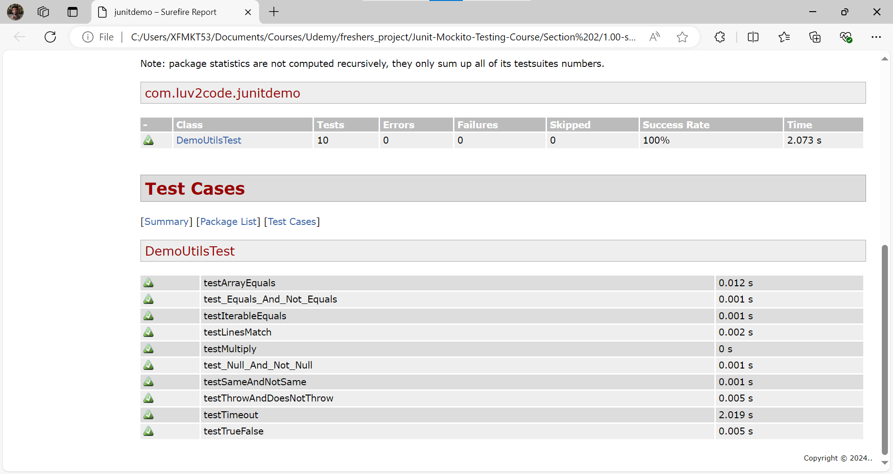

# 27. Unit Testing Code Coverage With Maven - Coding Part 2

Add the **Maven SureFire Report Plugin** to generate HTML unit test Report
This is how you add this to the **Pom.xml** file, shown below
```XML
            <plugin>
                <groupId>org.apache.maven.plugins</groupId>
                <artifactId>maven-surefire-report-plugin</artifactId>
                <version>3.1.2</version>
                <executions>
                    <execution>
                        <phase>test</phase>
                        <goals>
                            <goal>report</goal>
                        </goals>
                    </execution>
                </executions>
            </plugin>
```
2. After which you run the command - **mvn clean test**
    1. Then you hit the command - **mvn site -DgenerateReports=false**
Meaning of the above command -
Sure! Let's break it down:

### Command: `mvn site -DgenerateReports=false`

- **[`mvn`]**: This is the command to run Maven, a build automation tool used primarily for Java projects.
- **[`site`]**: This goal generates a site (a set of HTML documents) for the project, including reports and project information.
- **`-DgenerateReports=false`**: This is a flag that tells Maven not to generate the default reports when creating the site.

### Simple Explanation

When you run `mvn site -DgenerateReports=false`, you are asking Maven to create a website for your project, but you are telling it not to include the default reports in that website.

### Why Use This Command?

- **Generate Project Site**: You want to create a website that contains information about your project.
- **Exclude Default Reports**: You might not need the default reports, or you might want to generate them separately or customize them.

### Example Scenario

1. **Run Tests**: First, you run your tests with `mvn clean test`.
2. **Generate Site**: Then, you generate the project site without the default reports using `mvn site -DgenerateReports=false`.

This way, you get a clean project site without the extra reports you might not need at that moment.   

