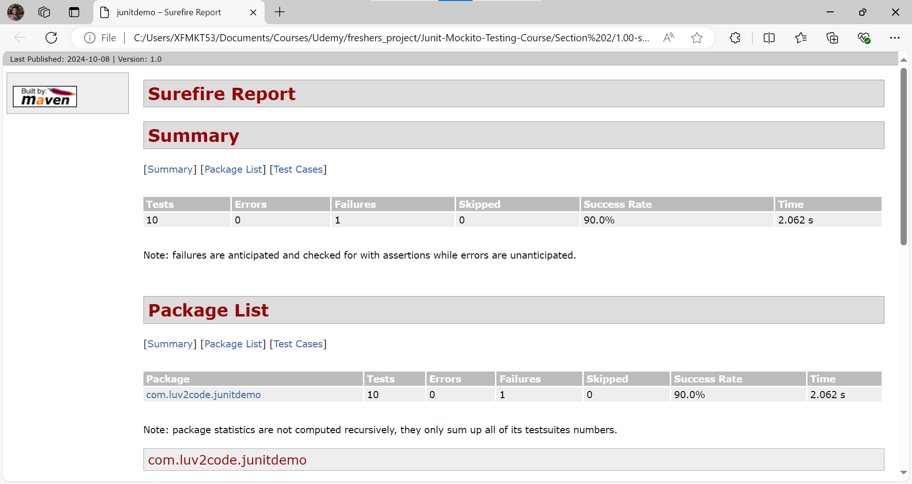

# 27. Unit Testing Code Coverage With Maven - Coding Part 3

1. Here we make the use of **testFailureIgnore** - This makes sure that the report is generated even though so of the tests fails

If you just break your code wantedly, like we did below
```Java
    // Here we modified this below method
    public int multiply(int a, int b) {
        return a * b * b * b;
    }
```
After which we run - **mvn clean test**
The command doesn't run completely because we have purposefully introduced some errors in the code and also as all the test cases didn't pass, the respective code Coverage report doesn't get generated because some of the tests are getting failed here

In order to overcome this problem we make some changes in the **pom.xml** file so that we can generate html files even though we have errors while running our tests
```XML
<build>
        <plugins>
            <plugin>
                <groupId>org.apache.maven.plugins</groupId>
                <artifactId>maven-surefire-plugin</artifactId>
                
                <configuration>
                    <testFailureIgnore>true</testFailureIgnore>
                </configuration>
            </plugin>

            <plugin>
                <groupId>org.apache.maven.plugins</groupId>
                <artifactId>maven-surefire-report-plugin</artifactId>
                <version>3.1.2</version>
                <executions>
                    <execution>
                        <phase>test</phase>
                        <goals>
                            <goal>report</goal>
                        </goals>
                    </execution>
                </executions>
            </plugin>
        </plugins>
    </build>
```
We have to set the **testFailureIgnore** attribute to true - So that even though some tests fail, we generate our respective HTML file


As we can see we get the value of **failure column** to be 1, even though there is a **failure case** our HTML file is generated

