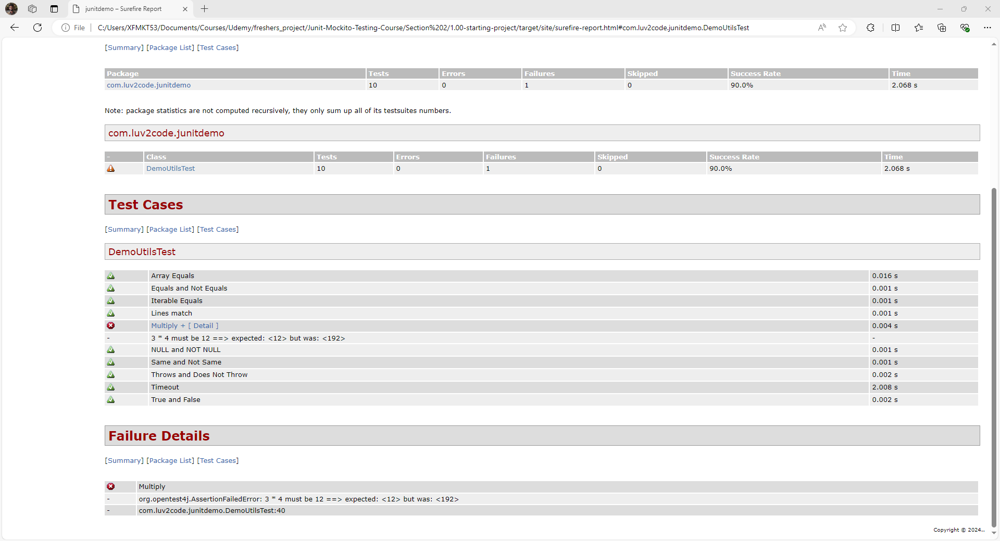
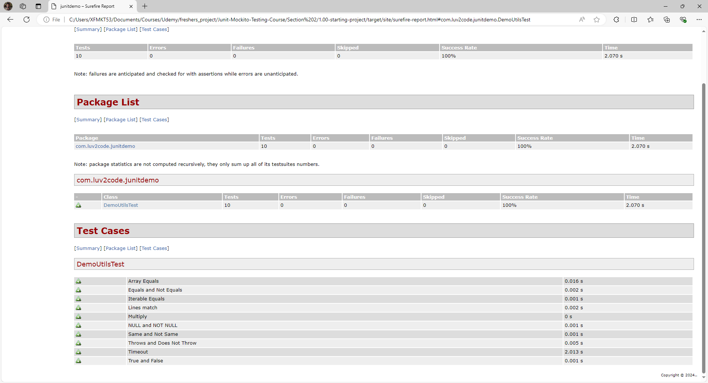

# 29. Unit Testing Code Coverage With Maven - Coding Part 4

In order to make the display names show in the report   
go the the Website - https://maven.apache.org/surefire/  
Then click Maven Surefire Plugin from the left side column   
Then Under the Examples - **Choose Using JUnit 5 Platform**

Go to the topic - **SureFire Extension and Reports Configuration for @DisplayName**
    1. Copy the statelessTestsetReported block from the XML file

```XML
            <plugin>
                <groupId>org.apache.maven.plugins</groupId>
                <artifactId>maven-surefire-plugin</artifactId>

                <configuration>
                    <testFailureIgnore>true</testFailureIgnore>
                    <statelessTestsetReporter implementation="org.apache.maven.plugin.surefire.extensions.junit5.JUnit5Xml30StatelessReporter">
                        <usePhrasedTestCaseMethodName>true</usePhrasedTestCaseMethodName>
                    </statelessTestsetReporter>
                </configuration>
            </plugin>
```

Add the **statelessTestSetReporter** to the **surefire plugin**
and set the attribute (**usePhrasedTestCaseMethodName**) to **True**
This sets the **ShowDisplayName** to **True** - so that in the Test Coverage Report we get the values that are set to the **DisplayName Annotation** instead of the **MethodNames**

And now in the **Output** - it will be showing us the display names



In order to show clear output we rectify all the breaks we did in the code, 
and hence we get the output that is shown below

