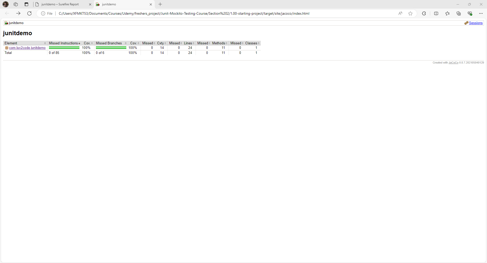

# 30. Unit Testing Code Coverage with Maven - Coding - Part 5

1. We use JCoCo here - JaCoCo Maven Plugin Concept 
We make the necessary changes that are shown below in the **Pom.xml** file 
```XML
            <plugin>
                <groupId>org.jacoco</groupId>
                <artifactId>org.jacoco.core</artifactId>
                <version>0.8.7</version>

                <executions>
                    <execution>
                        <id>jacoco-prepare</id>
                        <goals>
                            <goal>prepare-agent</goal>
                        </goals>
                    </execution>

                    <execution>
                        <id>jacoco-report</id>
                        <phase>test</phase>
                        <goals>
                            <goal>report</goal>
                        </goals>
                    </execution>
                </executions>
            </plugin>
```
Now go to the terminal window 
1. mvn clean test - The respective file will be saved in the directory (target->site->jacoco->index.html)\


