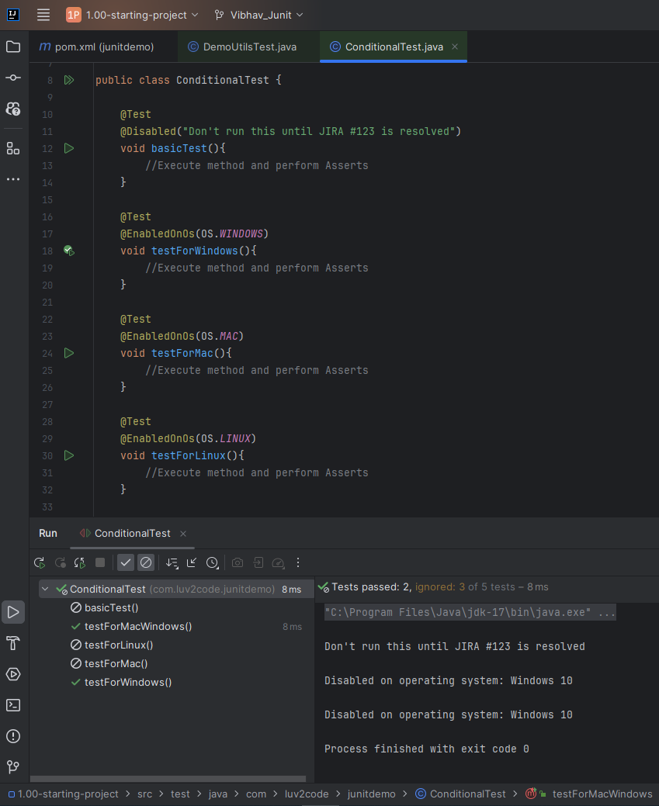

# 32. Conditional Tests - Coding - @Disabled and @EnabledOnOs - Part 1

```Java
public class ConditionalTest {

    @Test
    @Disabled("Don't run this until JIRA #123 is resolved")
    void basicTest(){
        //Execute method and perform Asserts
    }

    // Runs only on Windows
    @Test
    @EnabledOnOs(OS.WINDOWS)
    void testForWindows(){
        //Execute method and perform Asserts
    }

    // Runs only on MAC
    @Test
    @EnabledOnOs(OS.MAC)
    void testForMac(){
        //Execute method and perform Asserts
    }

    // Runs only on Linux
    @Test
    @EnabledOnOs(OS.LINUX)
    void testForLinux(){
        //Execute method and perform Asserts
    }

    // Runs on both Linux and Windows
    @Test
    @EnabledOnOs({OS.LINUX,OS.WINDOWS})
    void testForMacWindows(){
        //Execute method and perform Asserts
    }
}
```

### Output


As we can see from the image fuctions that doesn't meet the criteria gets disabled

