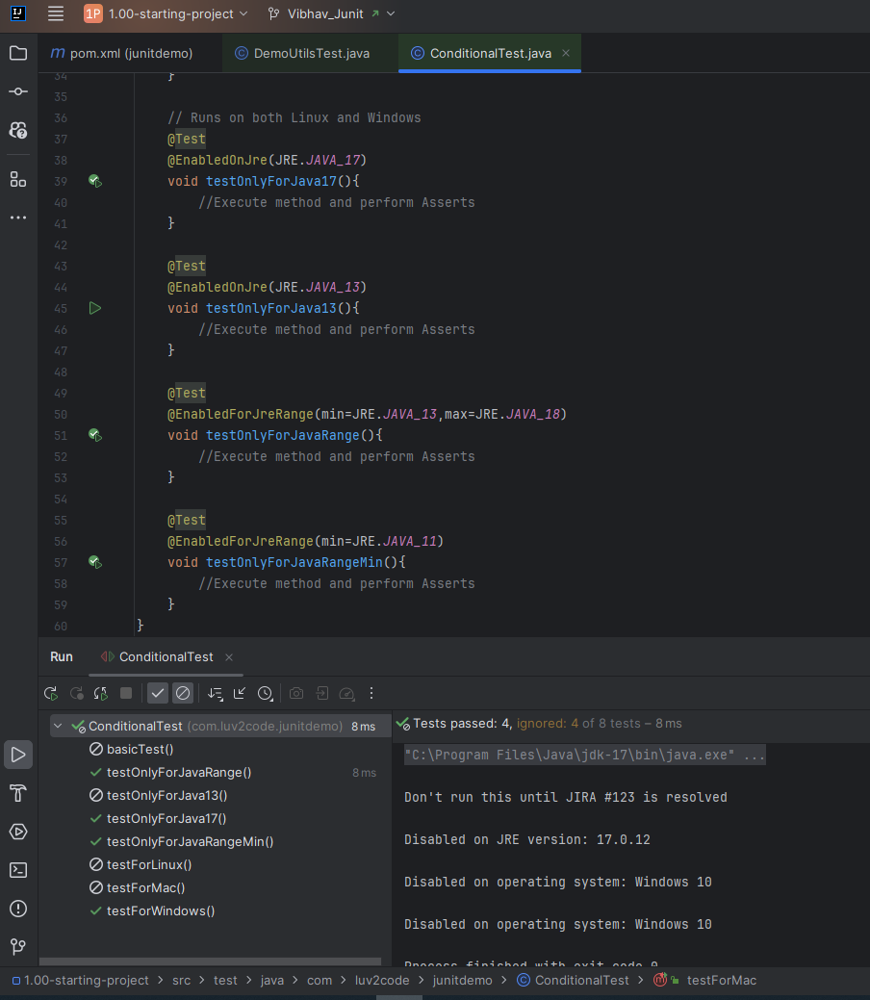

# 33. Conditional Tests - Coding - @EnabledOnJRE and @EnabledForJreRange - Part 2

```Java
public class ConditionalTest {
    // Will run only on Java 17
    @Test
    @EnabledOnJre(JRE.JAVA_17)
    void testOnlyForJava17(){
        //Execute method and perform Asserts
    }

    @Test
    @EnabledOnJre(JRE.JAVA_13)
    void testOnlyForJava13(){
        //Execute method and perform Asserts
    }

    @Test
    @EnabledForJreRange(min=JRE.JAVA_13,max=JRE.JAVA_18)
    void testOnlyForJavaRange(){
        //Execute method and perform Asserts
    }

    @Test
    @EnabledForJreRange(min=JRE.JAVA_11)
    void testOnlyForJavaRangeMin(){
        //Execute method and perform Asserts
    }
}
```
### Output 


As we can see from the above output
1. EnabledOnJre(JDK 17) gets executed as the current Java Version is 17
2. Method doesn't get executed cause the current Java Version is 17 and not 13
3. Method get's executed cause it fits 17 fits within the range (13-18) even if you give max as **JRE.JAVA_17** also the method will execute cause 17 is the max value
4. method gets executed cause the version 17 is definitely above the version 11