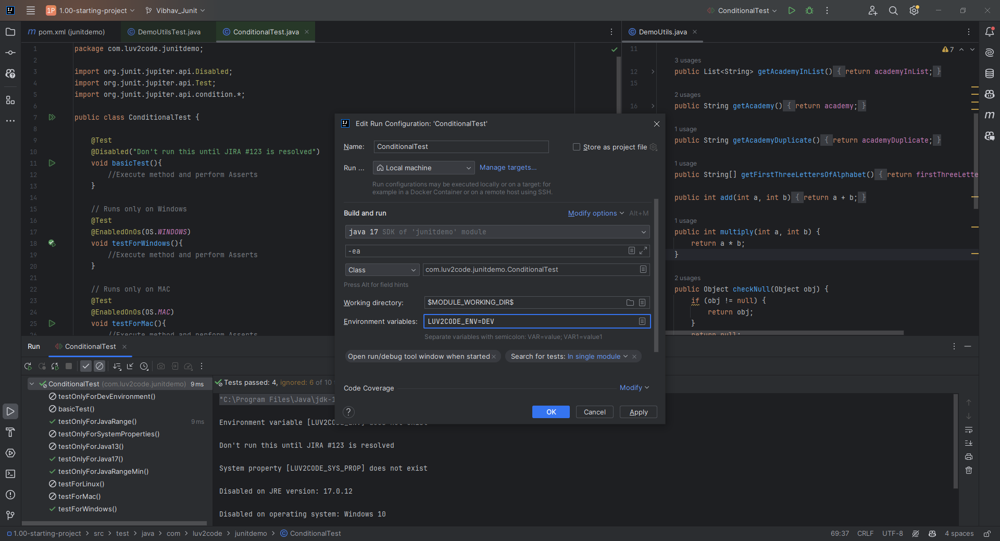

# 34. Conditional Tests - Coding - @EnabledOnJRE and @EnabledForJreRange - Part 3

```Java
    @Test
    @EnabledIfEnvironmentVariable(named="LUV2CODE_ENV", matches="DEV")
    void testOnlyForDevEnvironment(){
        // Execute method and perform assets
    }

    @Test
    @EnabledIfSystemProperty(named="LUV2CODE_SYS_PROP", matches = "CI_CD_DEPLOY")
    void testOnlyForSystemProperties(){
        // Execute method and perform assets
    }
```
### Output for EnabledIfEnvironmentVariable
**NOTE** - This tells us on how to handle set the EnvironmentVariable for **Modify Run Configuration**
   
> And then if you run the Code we can see the particular **EnabledIfEnvironmentVariable** method gets executed


### Output for EnabledIfSystemProperty
**NOTE** - This tells us on how to handle set the SystemProperty for **Modify Run Configuration**

> And then if you run the Code we can see the particular **EnabledIfSystemProperty** method gets executed

