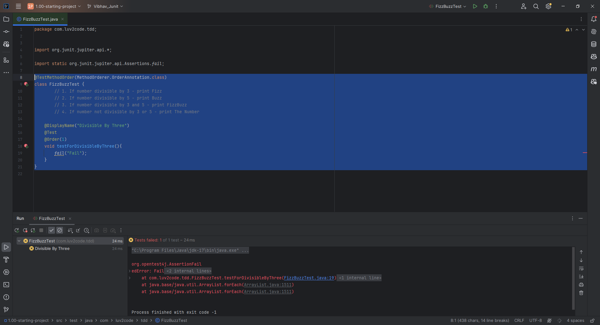

# 36. FizzBuzz Project - Coding - Getting Started


### We are just creating the base template here
```Java
@TestMethodOrder(MethodOrderer.OrderAnnotation.class)
class FizzBuzzTest {
        // 1. If number divisible by 3 - print Fizz
        // 2. If number divisible by 5 - print Buzz
        // 3. If number divisible by 3 and 5 - print FizzBuzz
        // 4. If number not divisible by 3 or 5 - print The Number

    @DisplayName("Divisible By Three")
    @Test
    @Order(1)
    void testForDivisibleByThree(){
        fail("Fail");
    }
}
```
### Output


