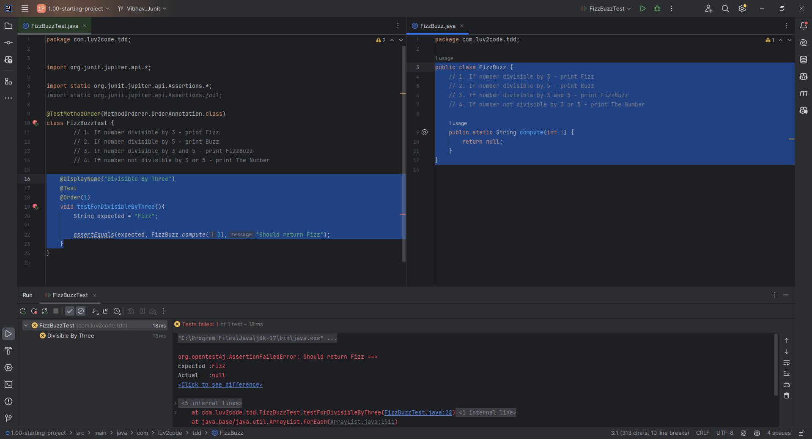
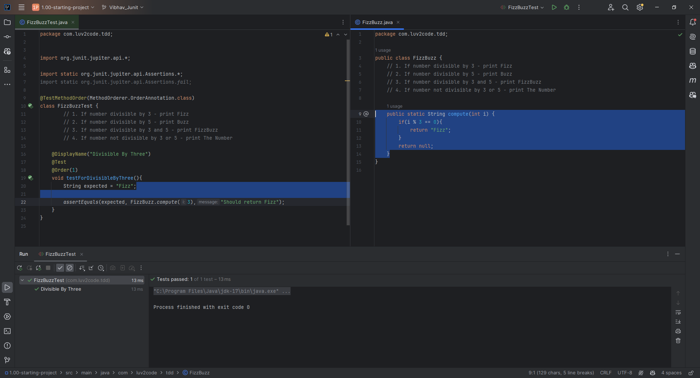
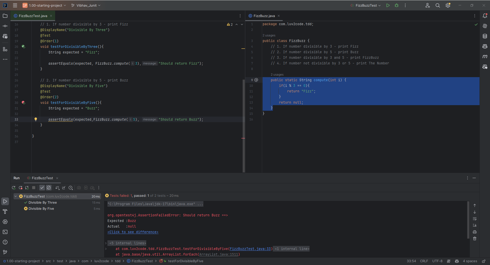
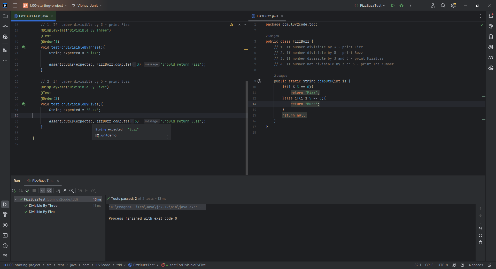

# 37. FizzBuzz Project - Coding - Tests Part 1

stub - piece of code used to stand in for some other programming functionality

**Conditions**
1. If number divisible by 3 - print Fizz
2. If number divisible by 5 - print Buzz
3. If number divisible by 3 and 5 - print FizzBuzz
4. If number not divisible by 3 or 5 - print The Number


A. Initially we create a method called testForDivisibleByThree, which has a assertEquals method
```Java
    @DisplayName("Divisible By Three")
    @Test
    @Order(1)
    void testForDivisibleByThree(){
        String expected = "Fizz";

        assertEquals(expected, FizzBuzz.compute(3),"Should return Fizz");
    }

    // We Create an equivalent class for this called - FizzBuzz
    public class FizzBuzz {
        public static String compute(int i) {
            return null;
        }
    }
```
### output - This retruns an error initially 


B. And now we modify that piece of code where we got an Error
```Java
    public static String compute(int i) {
        if(i % 3 == 0){
            return "Fizz";
        }
        return null;
    }
```
### Output - All the errors are rectified and the code works



C. What we did Above is a **Test Driven Developement**
1. We Wrote a **Failing Test**
2. We Wrote a small bit of code to make the test pass 
3. We repeat the process again

D. Now we write the next Failing test - **Divisible by 5 and then modify it**
```Java
    // 2. If number divisible by 5 - print Buzz
    @DisplayName("Divisible By Five")
    @Test
    @Order(2)
    void testForDivisibleByFive(){
        String expected = "Buzz";

        assertEquals(expected,FizzBuzz.compute(5), "Should return Buzz");
    }
```
### Output


E. Now we made the necessary changes in the FizzBuzz class 
```Java
    public static String compute(int i) {
        if(i % 3 == 0){
            return "Fizz";
        }else if(i % 5 == 0){
            return "Buzz";
        }
        return null;
    }
```
### Output



