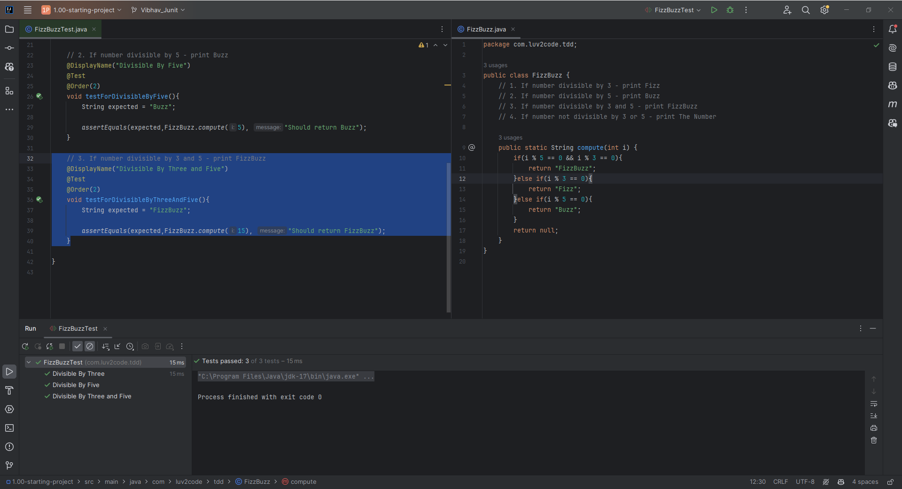

# 38. FizzBuzz Project - Coding - Tests Part 2

### If the number is divisible by both 3 and 5 - This has to return FizzBuzz
```Java
    // 3. If number divisible by 3 and 5 - print FizzBuzz
    @DisplayName("Divisible By Three and Five")
    @Test
    @Order(2)
    void testForDivisibleByThreeAndFive(){
        String expected = "FizzBuzz";

        assertEquals(expected,FizzBuzz.compute(15), "Should return FizzBuzz");
    }
    // Respective FizzBuzz Class
    public static String compute(int i) {
        if(i % 3 == 0){
            return "Fizz";
        }else if(i % 5 == 0){
            return "Buzz";
        }
        return null;
    }
```
### Output - As we didn't write the respective logic if the number is divisible by both 3 and 5. The above code returns an error 


### And now we make the respective changes and modify the code 
```Java
    // 3. If number divisible by 3 and 5 - print FizzBuzz
    @DisplayName("Divisible By Three and Five")
    @Test
    @Order(2)
    void testForDivisibleByThreeAndFive(){
        String expected = "FizzBuzz";

        assertEquals(expected,FizzBuzz.compute(15), "Should return FizzBuzz");
    }
    // Respective FizzBuzz Class
    public static String compute(int i) {
        if(i % 5 == 0 && i % 3 == 0){
            return "FizzBuzz";
        }else if(i % 3 == 0){
            return "Fizz";
        }else if(i % 5 == 0){
            return "Buzz";
        }
        return null;
    }
```
### Output


### Again invoking error for not divisible by 3 and 5
After we invoke the error we make necessary changes in the code so that we pass the desired test case, which is shown below
```Java
    // 4. If number not divisible by 3 or 5 - print The Number
    @DisplayName("Not Divisible By Three and Five")
    @Test
    @Order(2)
    void testForNotDivisibleByThreeAndFive(){
        String expected = "FizzBuzz";

        assertEquals(expected,FizzBuzz.compute(15), "Should return FizzBuzz");
    }

    // Respect FizzBuzz class code
    public static String compute(int i) {
        if(i % 5 == 0 && i % 3 == 0){
            return "FizzBuzz";
        }else if(i % 3 == 0){
            return "Fizz";
        }else if(i % 5 == 0){
            return "Buzz";
        }else{
            return Integer.toString(i);
        }
    }
```
### Output
