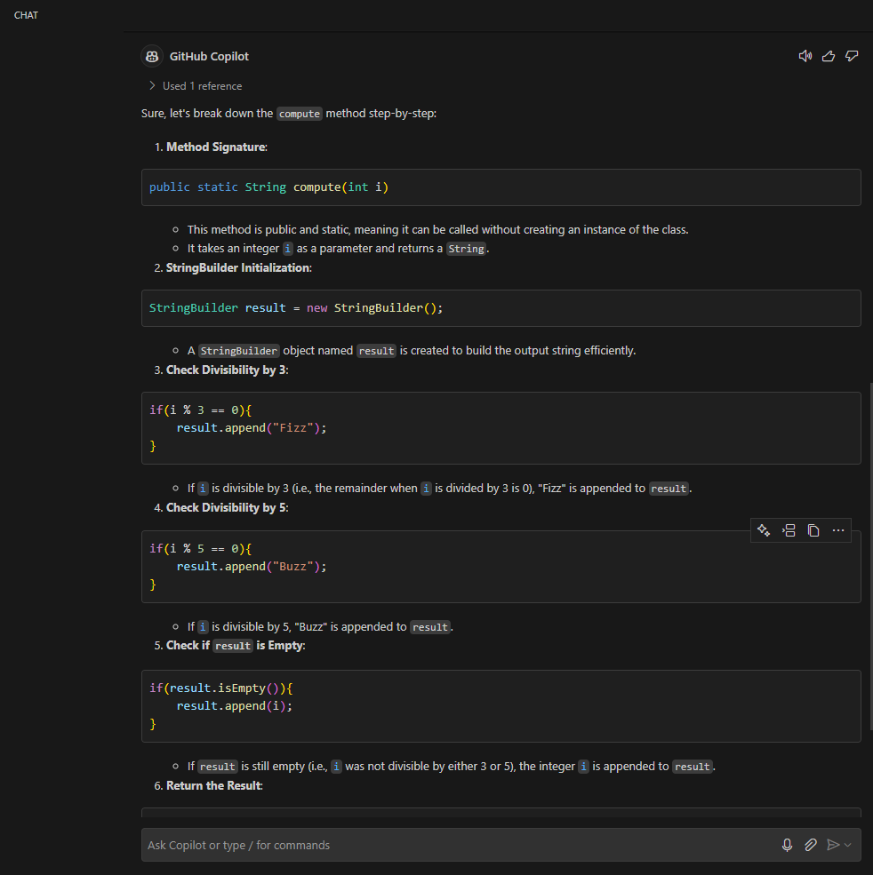
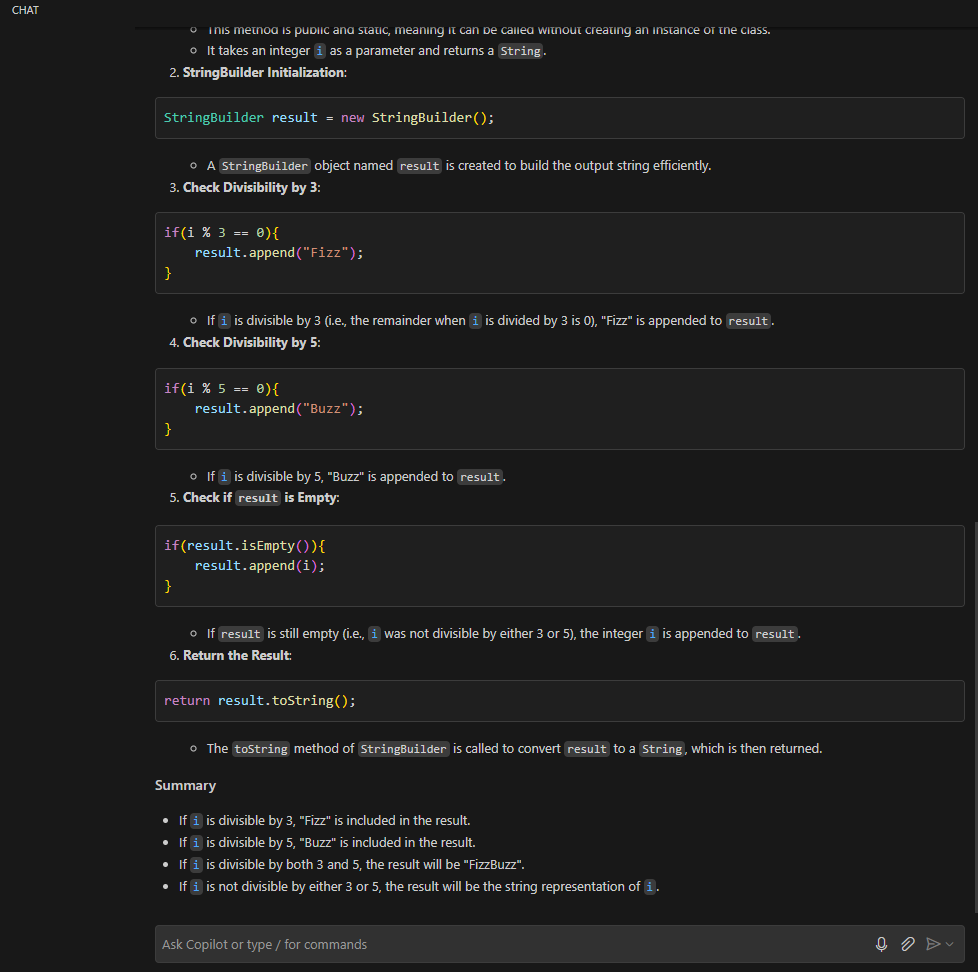

# 39. FizzBuzz Project - Coding - Refactoring 

```Java    
    // Trying a different solution
    public static String compute(int i){
        StringBuilder result = new StringBuilder();

        if(i % 3 == 0){
            result.append("Fizz");
        }
        if(i % 5 == 0){
            result.append("Buzz");
        }
        if(result.isEmpty()){
            result.append(i);
        }
        return result.toString();
    }
```
### Explanation

