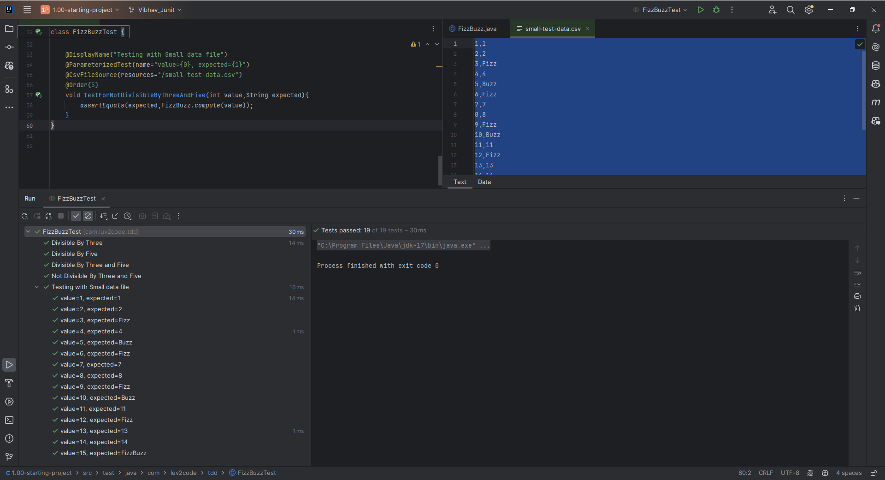
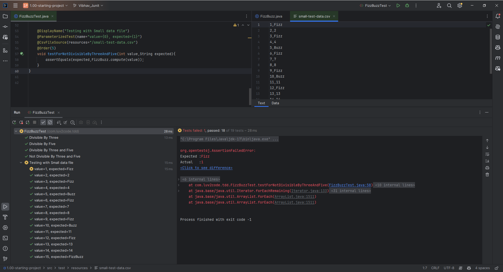

# 40. Parameterized Tests - Coding - Part 1

1. Creating a CSV file initially
```CSV
1,1
2,2
3,Fizz
4,4
5,Buzz
6,Fizz
7,7
8,8
9,Fizz
10,Buzz
11,11
12,Fizz
13,13
14,14
15,FizzBuzz
```

2. Testing with **ParameterizedTest** with the **simple csv file** that is made
```Java
    @DisplayName("Testing with Small data file")
    @ParameterizedTest(name="value={0}, expected={1}")
    @CsvFileSource(resources="/small-test-data.csv")
    @Order(5)
    void testForNotDivisibleByThreeAndFive(int value,String expected){
        assertEquals(expected,FizzBuzz.compute(value));
    }
```
### Output


3. We break the code now and check whether it is returning Error
```CSV
1,Fizz
2,2
3,Fizz
4,4
5,Buzz
6,Fizz
7,7
8,8
9,Fizz
10,Buzz
11,11
12,Fizz
13,13
14,14
15,FizzBuzz
```
### Output

And yes it is returning error
