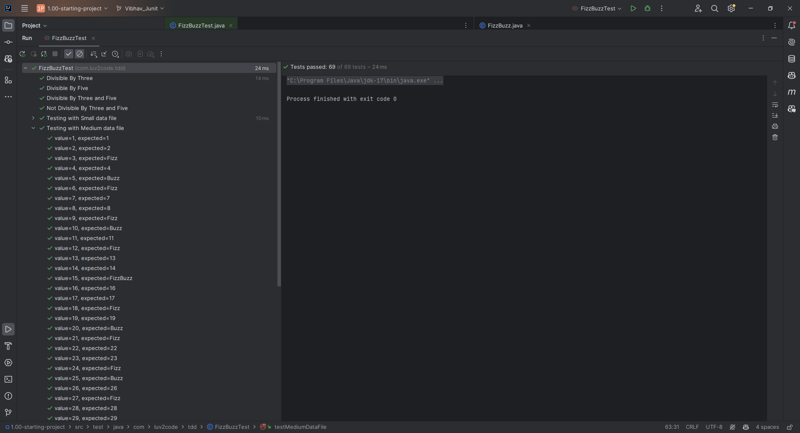
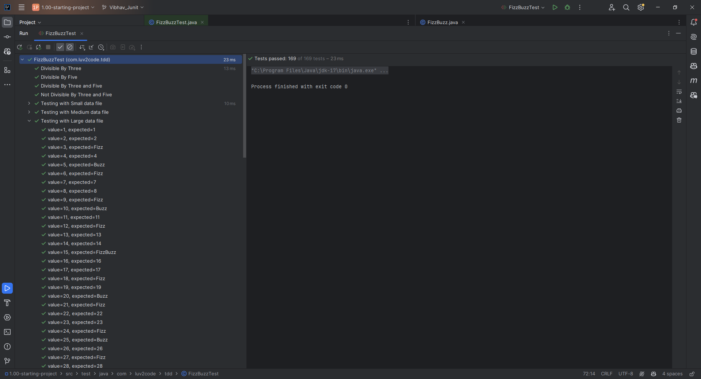

# 42. Parameterized Test Coding - Part 2

1. Testing with other two CSV's namely - 
    1. Medium test data files
    2. Large test data files 

### The respective code for them 

```Java 
    // For Medium Data Files
    @DisplayName("Testing with Medium data file")
    @ParameterizedTest(name="value={0}, expected={1}")
    @CsvFileSource(resources="/medium-test-data.csv")
    @Order(6)
    void testMediumDataFile(int value,String expected){
        assertEquals(expected,FizzBuzz.compute(value));
    }
    // For Large Data Files 
    @DisplayName("Testing with Large data file")
    @ParameterizedTest(name="value={0}, expected={1}")
    @CsvFileSource(resources="/large-test-data.csv")
    @Order(7)
    void testLargeDataFile(int value,String expected){
        assertEquals(expected,FizzBuzz.compute(value));
    }
```
## Output 
1. For Medium data files

2. For Large data files 
